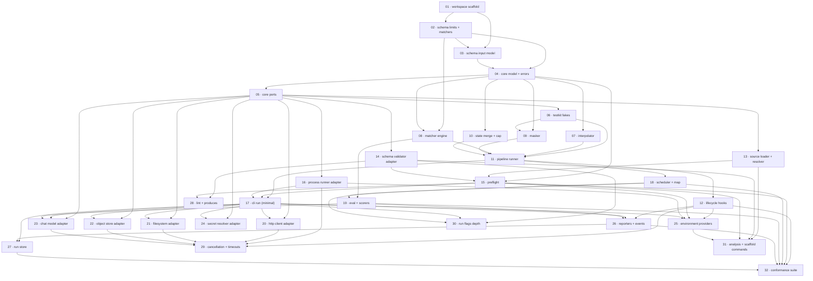

# Plan: TMX Rust Runtime and CLI Implementation

**Status:** Draft · **Layout:** kanban · **Date:** 2026-07-05 · **Owner:** Ant Stanley · **Source spec:** [`.specs/`](../../00-overview.md) (repo-wide canonical set)

Build the TMX runtime and `tmx` CLI as the single Cargo workspace the [spec set](../../00-overview.md) describes — a pure hexagonal core (`tmx-core`) surrounded by an input data model (`tmx-schema`), built-in adapters (`tmx-adapters`), in-memory fakes (`tmx-testkit`), and the driving CLI (`tmx-cli`), in the pragmatic Tiger Style the specs commit to. The decomposition is 32 task packages across 7 milestones. The reviewability spine leads with the enablers everything is reviewed through — the workspace and its purity/lint gates, then the schema types, the runtime model, the port traits, and the fake adapters — then the pure core services (interpolation, matchers, masking, state merge), then the sequential runner, and only then broadens. The load-bearing checkpoint is **M4**, where `tmx run flow.yaml` executes a real `exec`/`assert` flow end to end and prints masked final state; every task type, adapter, provider, reporter, and command after it is reviewed through that working path.

---

## Source and definition-of-done baseline

- **Spec.** The repo-wide canonical set under [`.specs/`](../../00-overview.md): the overview, [01 domain model](../../01-domain-model.md), [02 crate architecture](../../02-crate-architecture.md), [03 loading and preflight](../../03-loading-and-preflight.md), [04 execution engine](../../04-execution-engine.md), [05 fan-out and eval](../../05-fan-out-and-eval.md), [06 ports and adapters](../../06-ports-and-adapters.md), [07 CLI](../../07-cli.md), [08 errors and observability](../../08-errors-and-observability.md), the cross-cutting [architecture-principles.md](../../architecture-principles.md) and [development-guidelines.md](../../development-guidelines.md), and the runtime-type sidecar [canonical-types.schema.json](../../canonical-types.schema.json). The input contract is the frozen data-model schema [`tmx.schema.json`](../../../docs/tmx.schema.json) at 0.2.0, which this plan consumes but does not change.
- **Already built.** Greenfield — no `crates/`, `Cargo.toml`, `rust-toolchain.toml`, or `.rs` file exists (confirmed by a working-tree read: only `docs/`, `.specs/`, `scripts/`, the schemas, and the design drafts are present). The schemas, the example corpus, and `scripts/validate.sh` are preconditions the runtime must stay parity with, not tasks.
- **Definition of done.** Every task inherits [`development-guidelines.md` §Definition of done](../../development-guidelines.md#definition-of-done) and [§Limits and bounds](../../development-guidelines.md#limits-and-bounds): behaviour exercised by a test; negative-space tests for every new validation path; at least two meaningful assertions per new or touched core function; every new bound a named units-last constant in `tmx-schema::limits`; `cargo fmt --all`, `cargo clippy --all-targets --all-features -D warnings`, and `cargo nextest run` clean; `scripts/validate.sh` clean when a schema or example changed; a change description stating the *why*. Each task file adds only its task-specific acceptance on top of this baseline, and always ends its DoD with a `Reviewable:` line.

---

## Task graph

The dependency table is the **source of truth**; the Mermaid graph visualizes it. If the two ever disagree, the table wins. `Depends on` references lower task numbers only — a property of numbering in implementation order. Edge kinds: **build** (B's code needs A to exist), **data** (B reads a shape A defines), **contract** (B implements/calls a port A declares), **review** (B cannot be exercised end to end until A works).

| Task | Depends on | Edge kind | Produces (reviewable artifact) |
|---|---|---|---|
| 01 · workspace scaffold | — | — | `cargo build`/`fmt --check`/`clippy -D warnings` clean on five empty crates; the `cargo tree` purity gate rejects a tokio edge into core/schema/testkit |
| 02 · schema limits + matchers | 01 | build | every named limit constant and the closed `MatcherName` enum, with compile-time sanity assertions |
| 03 · schema input model | 01, 02 | build, build | the whole example corpus deserializes into `Flow`/`Task`/`TaskWith`, both array and map forms, in source order |
| 04 · core model + errors | 02, 03 | build, build | runtime entities and `RunError`/`ErrorCategory` serialize and validate against `canonical-types.schema.json` |
| 05 · core ports | 04 | build | the driven and driving port traits compile; the core is generic/`dyn` over them |
| 06 · testkit fakes | 05 | contract | an in-memory port bundle (serial scheduler, fixed clock/ids, recording I/O) injectable into any use case; purity gate green |
| 07 · interpolator | 04 | build | `${{ }}` resolves every namespace; unknown key and over-limit expression are typed errors; property tests pass |
| 08 · matcher engine | 02, 04 | build, build | each of the 25 matchers scores correctly with `not`; exhaustiveness asserted; property tests pass |
| 09 · masker | 04, 06 | build, build | secrets redacted inside nested JSON; short-value scan floor honoured; a leaked-secret negative test fails closed |
| 10 · state merge + cap | 04 | build | merge under `output ?? name`; over-cap is `state_cap_exceeded` naming the task; blob/message normalization; below/at/above-cap tests |
| 11 · pipeline runner | 06, 07, 08, 09, 10 | contract, build, build, build, build | `RunFlow` over the fakes runs a multi-task `assert`/`exec` flow, emits the event stream, and returns masked final state |
| 12 · lifecycle hooks | 11 | build | `create`/`change`/`destroy`/`error` fire at the right transitions, one level deep; a nested-hook attempt trips its assertion |
| 13 · source loader + resolver | 05 | contract | YAML/JSON/JSONC/TOML parse to one identical model; `kind` dispatch; cyclic `flow` import is a `ResolutionError` |
| 14 · schema validator adapter | 05 | contract | artifacts validate (Draft 2020-12), `kind`-dispatched, at parity with `scripts/validate.sh` on the corpus |
| 15 · preflight | 04, 13, 14 | build, review, review | a passing preflight yields `ResolvedFlow` + `CapabilitySet`; a malformed task aborts a directory run before any task executes; a missing capability is `EnvironmentError` |
| 16 · process runner adapter | 05 | contract | `exec`/`run` execute real processes with per-task timeout and a captured-output cap; a non-zero exit is a typed error |
| 17 · cli run (minimal) | 11, 15, 16 | build, build, build | `tmx run flow.yaml` loads, preflights, executes `exec`/`assert` tasks, prints masked final state to stdout, and returns the right exit code |
| 18 · scheduler + map | 11 | build | a `map` runs bounded concurrent fan-out; the output array follows item order; over-width and over-concurrency are typed errors |
| 19 · eval + scorers | 08, 18 | build, build | an `eval` over a dataset emits a `Scorecard`; a missed `threshold` fails the run; every scorer score is asserted in `[0,1]` |
| 20 · http client adapter | 05, 17 | contract, review | a `fetch` task performs a real request with bounded retries and timeout; a non-2xx body is handled as a typed result |
| 21 · filesystem adapter | 05, 17 | contract, review | `file` read/write/append/delete/copy/move/exists honour `encoding`; a missing path is a typed error |
| 22 · object store adapter | 05, 17 | contract, review | `store` get/put/delete/list/head against an S3-compatible endpoint; host failures are typed errors |
| 23 · chat model adapter | 05, 17, 19 | contract, review, build | a `chat-completion` task and the `llmRubric` scorer call the model; a non-conforming judge response is a typed error |
| 24 · secret resolver adapter | 05, 17 | contract, review | `env`/`file` secrets resolve and never leak; an unrequested secret is never resolved; the provider seam is present |
| 25 · environment providers | 12, 15, 16, 17 | build, build, build, build | `tmx env` drives a `BinaryProvider` and a `FlowProvider`; a failed method is `EnvironmentError` (exit 5); clean/destroy run best-effort |
| 26 · reporters + events | 12, 17, 19 | build, build, build | `--format pretty\|json\|ndjson` render the full event stream; every payload passes the Masker; stderr progress is independent of stdout data |
| 27 · run store | 17, 26 | build, build | runs persist to `.tmx/runs/<uuidv7>/` and list chronologically; the event log caps with `log.truncated`; retention prunes; `tmx runs` queries the masked record |
| 28 · lint + produces | 14, 15 | build, build | `tmx lint` catches typo'd `produces` reads, undeclared inputs, and unlisted secrets; `--check-produces` warns or fails at runtime |
| 29 · cancellation + timeouts | 12, 16, 20, 21, 22, 23 | build ×6 | a timed-out or interrupted run cancels in-flight work within the grace period, fires `destroy`, and exits 124/130 |
| 30 · run flags depth | 14, 17, 18 | build, build, build | the full `tmx run` flag surface (inputs, env, state-in/out, slicing, dry-run, matrix, concurrency, max-state-size, watch) behaves per spec |
| 31 · analysis + scaffold commands | 13, 14, 15, 25 | build, build, build, build | `validate`/`inspect`/`init`/`fmt`/`list`/`context`/`secrets`/`provider`/`version` work; `fmt` round-trips all four formats; config layers resolve |
| 32 · conformance suite | 12, 15, 18, 19, 26, 27 | build ×6 | golden Flows drive `RunFlow` with recorded adapters and assert the event stream + final state; every limit boundary is covered; CI runs the tier |

---

## Implementation order and milestones

**Order:** `01 … 32` — the numbering is the implementation order. The spine departs from a naive dependency-only sort in two deliberate ways. First, the **workspace scaffold (01)** and its purity/lint gates lead even though they run no behaviour, because every later task is reviewed *through* `cargo clippy -D warnings`, the `#![forbid(unsafe_code)]` lint, and the `cargo tree` purity check — the same reason auth leads an app plan. Second, the **first runnable CLI slice (13–17)** is pulled in ahead of the breadth of adapters and commands: rather than build all fifteen adapters and then wire a CLI, the plan finishes one thin end-to-end path (`tmx run` over `exec`/`assert`) first, so every subsequent task type (`fetch`, `file`, `store`, `chat-completion`), reporter, provider, and command is added to a binary a reviewer can already run.

**Milestones:**

| Milestone | Tasks | Demonstrable when complete | Review gate |
|---|---|---|---|
| M1 — foundations | 01, 02, 03, 04, 05, 06 | the workspace builds clean under the full lint/purity gate; the example corpus deserializes; the runtime types validate against the sidecar schema; a fake port bundle is injectable | `cargo fmt/clippy/build` green; purity gate rejects an I/O edge into core/schema/testkit; corpus round-trips |
| M2 — pure core services | 07, 08, 09, 10 | interpolation, matching, masking, and state merge each pass unit and property tests in isolation, with negative-space coverage | each service's positive/negative tests and property tests pass under `nextest` |
| M3 — execution engine | 11, 12 | `RunFlow` runs a multi-task flow through the fakes, emits the canonical event stream, fires lifecycle hooks one level deep, and returns masked final state | a core integration test runs a deterministic multi-task flow; every runner invariant asserts |
| M4 — first runnable CLI | 13, 14, 15, 16, 17 | `tmx run flow.yaml` loads any of the four formats, preflights fail-fast, executes `exec`/`assert` tasks, and prints masked final state; `tmx run … \| jq` works with no flag | a real flow file runs from the shell with correct stdout/stderr split and exit code |
| M5 — fan-out, eval, executors | 18, 19, 20, 21, 22, 23, 24 | every task type runs end to end: bounded `map`, measured `eval`, `fetch`, `file`, `store`, `chat-completion`; secrets resolve and stay masked | flows exercising each task type pass; each adapter's typed-error and cap paths are tested |
| M6 — environment, observability, runs | 25, 26, 27 | `tmx env` provisions via a provider; `--format` selects the reporter; runs persist and `tmx runs` lists them chronologically | a provisioned run records to `.tmx/runs/`, replays masked logs, and prunes on retention |
| M7 — depth and conformance | 28, 29, 30, 31, 32 | `tmx lint` and `--check-produces` catch dataflow defects; cancellation honours the grace period; the full `run` flag surface and remaining commands work; the golden-Flow conformance suite is green | the conformance tier passes deterministically in CI; the full CLI surface matches [07-cli.md](../../07-cli.md) |

---

## Assumptions and open questions

**Assumptions**

- The [spec set](../../00-overview.md) is settled for v0: every page's closing block records "Open questions: None currently", so the plan sequences against a fixed target rather than a moving one.
- The frozen data-model schema [`tmx.schema.json`](../../../docs/tmx.schema.json) 0.2.0 is the input contract; runtime output shapes are governed by [canonical-types.schema.json](../../canonical-types.schema.json), which this plan may extend but the data-model schema it does not change.
- A JSON-Schema-2020-12 validator crate covers the features the schemas use (`$ref`, `allOf`/`if`/`then`, cross-file `$ref`); if none does, task 14 records the gap.
- The team reviews per milestone — each milestone boundary is a sign-off point, which is why the order optimizes for the earliest reviewable state at each step.

**Decisions**

- *The workspace scaffold leads.* **Task 01 builds the five-crate workspace, the lint/format gate, and the `cargo tree` purity check before any behaviour.** Chosen because every later task is reviewed through those gates; a purity regression or an `unsafe` slip is cheapest to catch when the crates are still empty.
- *One thin CLI path before breadth.* **The plan completes `tmx run` over `exec`/`assert` (M4) before adding the other task types, adapters, and commands.** Chosen over a horizontal "all adapters, then all CLI" order so that every subsequent capability is added to a binary a reviewer can already exercise, rather than deferring the first demonstrable run to the end.
- *The pure core services are their own packages.* **Interpolation (07), matching (08), masking (09), and state merge (10) are separate tasks, not folded into the runner (11).** Chosen because each is a pure, independently property-testable unit with its own negative-space obligations (a leaked-secret test, an over-cap test, an over-deep-expression test), and the runner is far easier to review once they are trusted.
- *Adapters are sliced per backend, not batched.* **`fetch`/`file`/`store`/`chat-completion` are four tasks (20–23), each an adapter plus its task type exercised through the CLI.** Chosen because each backend has distinct failure, timeout, and cap semantics that warrant their own tests; a single "adapters" package would exceed a one-sitting review and bury those differences.
- *Cancellation is a dedicated late task.* **Task 29 threads the cancellation token through every long-running adapter at once.** Chosen because the contract (grace period, `destroy` on cancel, exit 124/130) is cross-cutting and only reviewable once the adapters it must interrupt (16, 20–23) exist.
- *Certificates are authored per task.* **Every task file carries a co-located done certificate.** Chosen per the planner's default so a separate validating agent can discharge each task's definition of done during the build, keeping the author and the validator distinct.

**Open questions**

- *Native `async fn` in traits vs `#[async_trait]`.* The [architecture principles](../../architecture-principles.md#assumptions-and-open-questions) leave the driven-port async mechanism to be settled per port during the first implementation spike (object-safe `dyn Port` may still force the macro). This is resolved inside task 05 (port traits) and does not change the decomposition or the order.
